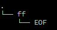
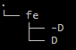

#  <font color="RED">D</font><font color="ORANGE">S</font><font color="BLUE">X</font> 

######  *<font color="GREY">Tutorials</font>*

#### 目录：

###### 	1. <a href="#intro">简介</a> 

###### 	2. <a href="install">安装</a>

###### 3. <a href="usage">用法</a>

###### 3.1 <a href="#emacs">emacs 自带指令</a>

###### 3.2 <a href="#restart-emacs">restart-emacs 重启（可选）</a>

###### 3.3 <a href="#ace-window">ace-window 窗口跳转（可选）</a>

###### 3.4 <a href="#avy">avy 全局跳转（可选）</a>

###### 3.5 <a href="#iedit">iedit 重构字符串 （可选）</a>

###### 3.6 <a href="#yasnippets">yasnippets 代码模板 （可选）</a>

###### 3.7 <a href="#neotree">neotree 文件浏览器（可选）</a>

###### 3.8 <a href="#yafolding">yafolding 代码折叠（可选）</a>

###### 	4. <a href="theory">原理</a>

###### 5. <a href="#history">历史</a>

###### 6. <a href="#license">许可证</a>

---

#### 1. <span id="intro">简介</span>

​    <font color="RED">D</font><font color="ORANGE">S</font><font color="BLUE">X</font> [di: es ten] 是关于命名体系的设计方案， 简化指令，形象助记， 避免类似 which-key 等

刷新提示界面， 延缓按键速率。

形如 ：

```lisp
M-x ff-EOF ;; alias -> ido-find-file
```

```lisp
M-x fe-D ;; alias -> ido-find-file ~/.emacs.d/init.el
```

```lisp
M-x fe--D ;; alias -> ANY-find-file ~/.emacs.d/init.el
```

---

#### 2.  <span id="install">安装</span>

a. 切换到 emacs 的家目录， 创建 site-lisp 目录， 并且通过 git 工具克隆 ：

```shell
cd ~/.emacs.d/ # change to emacs home directory
mkdir site-lisp
cd site-lisp
git clone https://github.com/DSX.git # clone to site-lisp
```

 b. 编辑 ~/.emacs.d/init.el 文件， 启动 <font color="RED">D</font><font color="ORANGE">S</font><font color="BLUE">X</font> 设计方案 ：

```lisp
(require 'DSX) ;; launch DSX
(DSX-mode)
```

---

#### 3.  <span id="usage">用法</span>

敲击 M-x，键入以下命令后，&lt;TAB&gt; 推出（建议）或 &lt;ENTER&gt; 回车 ：

###### 3.1 <span id="emacs">emacs </span>

| <font color="RED">*Keys*</font> | *<font color="ORANGE">Functions</font>* | *<font color="BLUE">Descriptions</font>* |
| :-----------------------------: | :-------------------------------------: | :--------------------------------------- |
|             ad-EOF              |                  dired                  | 打开 Dired mode                          |
|             bb-EOF              |            switch-to-buffer             | 切换 Buffer                              |
|             bk-EOF              |               kill-buffer               | 关闭 Buffer                              |
|             cl-EOF              |              comment-line               | 行注释                                   |
|              cl-b               |       comment-or-uncomment-region       | 块注释                                   |
|              fe-D               |                DSXY-home                | 家目录                                   |
|              fe-R               |               eval-buffer               | 执行 Buffer                              |
|             ff-EOF              |              ido-find-file              | 查找或创建文件                           |
|             fs-EOF              |               save-buffer               | 保存 Buffer                              |
|              hh-B               |            describe-bindings            | 描述绑定信息                             |
|              hh-N               |            describe-fontset             | 描述字符集信息                           |
|              hh-F               |            describe-function            | 描述函数信息                             |
|              hh-K               |              describe-key               | 描述键信息                               |
|              hh-M               |              describe-mode              | 描述 Mode 信息                           |
|              hh-P               |             describe-packag             | 描述包信息                               |
|              hh-T               |             describe-theme              | 描述主题信息                             |
|              hh-V               |            describe-variable            | 描述变量信息                             |
|             pp-EOF              |          package-list-packages          | 包源                                     |
|             qQ-EOF              |       save-buffers-kill-terminal        | 退出                                     |
|              ww-H               |           split-window-below            | 水平分窗                                 |
|              ww-V               |           split-window-right            | 垂直分窗                                 |
|             wm-EOF              |          delete-other-windows           | 最大化窗                                 |
|             zc-EOF              |                 c-mode                  | Zookeeper C 语言 Mode                    |
|              zc-c               |                c++-mode                 | Zookeeper c++ 语言 Mode                  |
|              zc-s               |                css-mode                 | Zookeeper css 语言 Mode                  |
|              ze-l               |          elisp-byte-code-mode           | Zookeeper elisp 语言 Mode                |
|              zj-s               |               js-jsx-mode               | Zookeeper js 语言 Mode                   |
|              zh-t               |                html-mode                | Zookeeper htm 语言 Mode                  |

---

###### 3.2 <span id="restart-emacs">restart-emacs </span>(optional)

| <font color="RED">*Keys*</font> | *<font color="ORANGE">Functions</font>* | *<font color="BLUE">Descriptions</font>* |
| :-----------------------------: | :-------------------------------------: | ---------------------------------------- |
|             qR-EOF              |              restart-emacs              | 重启 Emacs                               |

---

###### 3.3 <span id="ace-window">ace-window </span>(optional)

| <font color="RED">*Keys*</font> | *<font color="ORANGE">Functions</font>* | *<font color="BLUE">Descriptions</font>* |
| :-----------------------------: | :-------------------------------------: | ---------------------------------------- |
|             jc-EOF              |           ace-jump-char-mode            | 通过字符跳转                             |
|             jw-EOF              |           ace-jump-word-mode            | 通过单词跳转                             |
|             jW-EOF              |               ace-window                | 通过窗口号跳转                           |

---

###### 3.4 <span id="avy">avy</span> (optional)

| <font color="RED">*Keys*</font> | *<font color="ORANGE">Functions</font>* | *<font color="BLUE">Descriptions</font>* |
| :-----------------------------: | :-------------------------------------: | ---------------------------------------- |
|             jl-EOF              |              avy-goto-line              | 全局跳转                                 |

---

###### 3.5 <span id="iedit">iedit</span> (optional)

| <font color="RED">*Keys*</font> | *<font color="ORANGE">Functions</font>* | *<font color="BLUE">Descriptions</font>* |
| :-----------------------------: | :-------------------------------------: | ---------------------------------------- |
|             se-EOF              |               iedit-mode                | 重构编辑                                 |

---

###### 3.6 <span id="yasnippets">yasnippets</span> (optional)

| <font color="RED">*Keys*</font> | *<font color="ORANGE">Functions</font>* | *<font color="BLUE">Descriptions</font>* |
| :-----------------------------: | :-------------------------------------: | ---------------------------------------- |
|              ya-s               |             yas-new-snippet             | 创建代码模板                             |
|              ya-S               |       yas-expand-from-trigger-key       | 展开代码模板                             |

---

###### 3.7 <span id="neotree">neotree</span> (optional)

| <font color="RED">*Keys*</font> | *<font color="ORANGE">Functions</font>* | *<font color="BLUE">Descriptions</font>* |
| :-----------------------------: | :-------------------------------------: | ---------------------------------------- |
|             ft-EOF              |             neotree-toggle              | 开启 / 关闭                              |
|              ft-c               |           neotree-create-node           | 创建文件                                 |
|              ft-C               |            neotree-copy-node            | 复制文件                                 |
|              ft-d               |           neotree-delete-node           | 删除文件                                 |
|              ft-I               |              neotree-enter              | 打开文件                                 |
|              ft-f               |             neotree-refresh             | 刷新                                     |
|              ft-r               |           neotree-rename-node           | 重命名文件                               |
|              ft-R               |           neotree-change-root           | 改变路径                                 |
|              ft-X               |          neotree-collapse-all           | 折叠目录                                 |
|              ft-z               |           neotree-quick-look            | 切换目录                                 |

---

###### 3.8<span id="yafolding"> yafolding</span> (optional)

| <font color="RED">*Keys*</font> | *<font color="ORANGE">Functions</font>* | *<font color="BLUE">Descriptions</font>* |
| :-----------------------------: | :-------------------------------------: | ---------------------------------------- |
|              fo-x               |         yafolding-hide-element          | 折叠代码                                 |
|              fo-X               |           yafolding-hide-all            | 折叠所有代码                             |
|              fo-z               |         yafolding-show-element          | 展开代码                                 |
|              fo-Z               |           yafolding-show-all            | 展开所有代码                             |

---

#### 4.  <span id="theory">原理</span>

​    它的原理类似于红黑树，是由 root、node、leaf、sentry、symbol（连接符）所构成。  它是以二叉树的形式呈现的。

形如 ：

```lisp
ff-EOF ;; alias -> ido-find-file
```



​    a. 这是 FirstNode 即左子树, ' . ' 是 Root， ' ff ' 是 Node，' EOF ' 是 Sentry。其中，首部 Root 不需要写出，

是逻辑上源的存在；节点 Node 必须要两个字符表示， 是指令语义存在； 尾部必须添加哨兵 EOF， 作为缺失叶子时， 

充当闭合 <font color="RED">D</font><font color="ORANGE">S</font><font color="BLUE">X</font> 树存在；单一字符的叶子 Leaf， 也是直观表示语义、行为， 以及闭合 <font color="RED">D</font><font color="ORANGE">S</font><font color="BLUE">X</font> 树。

```lisp
fe-D ;; alias -> ido-find-file ~/.emacs.d/init.el
fe--D ;; alias -> ANY-find-file ~/.emacs.d/init.el
```




​    b. ' fe-D ' 即 FirstNode, 是指令的主体存在, 而 ' fe--D ' 即 SecondaryNode，是辅助形式存在。当 FirstNode

不充分时添加，' fe-D ' 指向 emacs 的 init 文件， ' fe--D ' 可以指向用户的临时文件，但必须最后依然形成完整

的 <font color="RED">D</font><font color="ORANGE">S</font><font color="BLUE">X</font> 二叉树。

​    c. 建议：<font color="RED">D</font><font color="ORANGE">S</font><font color="BLUE">X</font>树的节数维持在 4 ~ 5 最好，其中仅包含 第 5 节尾部为哨兵的。 

---

#### 5. <span id="history">历史</span>

I 组成

II 结构

III 语义

IV 行为

V 哨兵

VI 左子树

VII 右子树

VIII <font color="RED">D</font><font color="ORANGE">S</font><font color="BLUE">X</font> 树

IX 实体

X <font color="RED">D</font><font color="ORANGE">S</font><font color="BLUE">X</font>

#### 6. <span id="license">许可证</span>

GPLv3orlater，完整信息在 《LICENSE》 文件中。