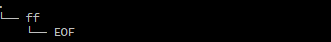
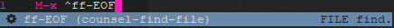
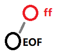
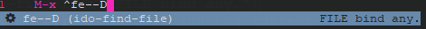
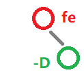

#  <font color="RED">D</font><font color="ORANGE">S</font><font color="BLUE">X</font> 

######  *<font color="GREY">Tutorials</font>*

#### Contents：

###### 	1. <a href="#intro">Introduce</a>

###### 2. <a href="prepare">Prepare</a>

###### 2.1. <a href="install">Install</a>

#### 2.2. <a href="property">Property</a>

###### 3. <a href="usage">Usage</a>

###### 3.1 <a href="#emacs">emacs: own order</a>

###### 3.2 <a href="#restart-emacs">restart-emacs: launch emacs (optional) </a>

###### 3.3 <a href="#ace-window">ace-window: jump in window  (optional)</a>

###### 3.4 <a href="#avy">avy: jump in global area (optional)</a>

###### 3.5 <a href="#iedit">iedit: reconstruct specific string (optional)</a>

###### 3.6 <a href="#yasnippets">yasnippets: code template (optional)</a>

###### 3.7 <a href="#neotree">neotree file tree or browse (optional)</a>

###### 3.8 <a href="#yafolding">yafolding: code folding (optional)</a>

###### 	4. <a href="theory">Theory</a>

###### 4.1 <a href="DSXTree">DSX Tree</a>

###### 4.2 <a href="FirstNode">FirstNode Model</a>

###### 4.3 <a href="SecondaryNode">SecondaryNode Model</a>

###### 4.4 <a href="suggestion">Suggestion</a>

###### 5. <a href="#history">History</a>

###### 6. <a href="#license">License</a>

---

#### 1. <span id="intro">Introduce</span>

​    <font color="RED">D</font><font color="ORANGE">S</font><font color="BLUE">X</font> [di: es ten]  is about the design scheme of naming system, which simplifies the  instruction, helps to remember vividly, avoids refreshing prompt  interface like which key, and delays the speed of keys. 

***e.g.***

```lisp
M-x ff-EOF ;; alias -> ido-find-file
```

```lisp
M-x fe-D ;; alias -> ido-find-file ~/.emacs.d/init.el
```

```lisp
M-x fe--D ;; alias -> ANY-find-file ~/.emacs.d/init.el
```

---

#### 2. <span id="prepare">Prepare</span>

###### 2.1  <span id="install">Install</span>

a. Switch to Emacs home directory, create site-lisp directory, and clone it

 through git tool ：

```shell
cd ~/.emacs.d/ # change to emacs home directory
mkdir site-lisp
cd site-lisp
git clone https://github.com/WolfBridge210/DSX.git # clone to site-lisp
```

 b. Edit ~/.emacs.d/init.el file， start the <font color="RED">D</font><font color="ORANGE">S</font><font color="BLUE">X</font> design schema ：

```lisp
(add-to-list 'load-path "~/.emacs.d/site-lisp/")
(require 'DSX) ;; launch DSX
(DSX-mode)
```

---

###### 2.2 <span id="property">配置</span>

a. Edit ~/.emacs.d/site-lisp/DSX.el

b. Select to cancel the specified comment according to [3. Usage] below 

c. Save

---

#### 3.  <span id="usage">用法</span>

Hit M-x，after typing the following command，then push &lt;TAB&gt;（suggestion）or

press &lt;ENTER&gt; ：

###### 3.1 <span id="emacs">emacs </span>

| <font color="RED">*Keys*</font> | *<font color="ORANGE">Functions</font>* | *<font color="BLUE">Descriptions</font>* |
| :-----------------------------: | :-------------------------------------: | :--------------------------------------- |
|             ad-EOF              |                  dired                  | Open Dired mode                          |
|             bb-EOF              |            switch-to-buffer             | Switch Buffer                            |
|             bk-EOF              |               kill-buffer               | kill Buffer                              |
|             cl-EOF              |              comment-line               | Line comment                             |
|              cl-b               |       comment-or-uncomment-region       | Block comment                            |
|              fe-D               |                DSXY-home                | Home init.el file                        |
|              fe-R               |               eval-buffer               | Synchronize Buffer                       |
|             ff-EOF              |              ido-find-file              | Find or create file                      |
|             fs-EOF              |               save-buffer               | Save Buffer                              |
|              hh-B               |            describe-bindings            | Describe binding information             |
|              hh-N               |            describe-fontset             | Describe fontset information             |
|              hh-F               |            describe-function            | Describe function information            |
|              hh-K               |              describe-key               | Describe key information                 |
|              hh-M               |              describe-mode              | Describe modeinformation                 |
|              hh-P               |             describe-packag             | Describe package information             |
|              hh-T               |             describe-theme              | Describe theme information               |
|              hh-V               |            describe-variable            | Describe variable information            |
|             pp-EOF              |          package-list-packages          | package source                           |
|             qQ-EOF              |       save-buffers-kill-terminal        | Exit emacs                               |
|              ww-H               |           split-window-below            | Split window to horizontal area          |
|              ww-V               |           split-window-right            | Split window to vertical area            |
|             wm-EOF              |          delete-other-windows           | Maximum window                           |
|             zc-EOF              |                 c-mode                  | Zookeeper C language Mode                |
|              zc-c               |                c++-mode                 | Zookeeper c++ language Mode              |
|              zc-s               |                css-mode                 | Zookeeper css language Mode              |
|              ze-l               |          elisp-byte-code-mode           | Zookeeper elisp language Mode            |
|              zj-s               |               js-jsx-mode               | Zookeeper js language Mode               |
|              zh-t               |                html-mode                | Zookeeper htm language Mode              |

---

###### 3.2 <span id="restart-emacs">restart-emacs </span>(optional)

| <font color="RED">*Keys*</font> | *<font color="ORANGE">Functions</font>* | *<font color="BLUE">Descriptions</font>* |
| :-----------------------------: | :-------------------------------------: | ---------------------------------------- |
|             qR-EOF              |              restart-emacs              | Launch emacs                             |

---

###### 3.3 <span id="ace-window">ace-window </span>(optional)

| <font color="RED">*Keys*</font> | *<font color="ORANGE">Functions</font>* | *<font color="BLUE">Descriptions</font>* |
| :-----------------------------: | :-------------------------------------: | ---------------------------------------- |
|             jc-EOF              |           ace-jump-char-mode            | Jump through characters                  |
|             jw-EOF              |           ace-jump-word-mode            | Jump through word                        |
|             jW-EOF              |               ace-window                | Jump through window number               |

---

###### 3.4 <span id="avy">avy</span> (optional)

| <font color="RED">*Keys*</font> | *<font color="ORANGE">Functions</font>* | *<font color="BLUE">Descriptions</font>* |
| :-----------------------------: | :-------------------------------------: | ---------------------------------------- |
|             jl-EOF              |              avy-goto-line              | Jump in global area                      |

---

###### 3.5 <span id="iedit">iedit</span> (optional)

| <font color="RED">*Keys*</font> | *<font color="ORANGE">Functions</font>* | *<font color="BLUE">Descriptions</font>* |
| :-----------------------------: | :-------------------------------------: | ---------------------------------------- |
|             se-EOF              |               iedit-mode                | Reconstruct edition                      |

---

###### 3.6 <span id="yasnippets">yasnippets</span> (optional)

| <font color="RED">*Keys*</font> | *<font color="ORANGE">Functions</font>* | *<font color="BLUE">Descriptions</font>* |
| :-----------------------------: | :-------------------------------------: | ---------------------------------------- |
|              ya-s               |             yas-new-snippet             | Create code snippet                      |
|              ya-S               |       yas-expand-from-trigger-key       | Expand code snippet                      |

---

###### 3.7 <span id="neotree">neotree</span> (optional)

| <font color="RED">*Keys*</font> | *<font color="ORANGE">Functions</font>* | *<font color="BLUE">Descriptions</font>* |
| :-----------------------------: | :-------------------------------------: | ---------------------------------------- |
|             ft-EOF              |             neotree-toggle              | On / off                                 |
|              ft-c               |           neotree-create-node           | Create file                              |
|              ft-C               |            neotree-copy-node            | Copy file                                |
|              ft-d               |           neotree-delete-node           | remove file                              |
|              ft-I               |              neotree-enter              | Open file                                |
|              ft-f               |             neotree-refresh             | Refresh interface                        |
|              ft-r               |           neotree-rename-node           | Rename file                              |
|              ft-R               |           neotree-change-root           | Change root directory                    |
|              ft-X               |          neotree-collapse-all           | Fold directory                           |
|              ft-z               |           neotree-quick-look            | Change to subdirectory                   |

---

###### 3.8<span id="yafolding"> yafolding</span> (optional)

| <font color="RED">*Keys*</font> | *<font color="ORANGE">Functions</font>* | *<font color="BLUE">Descriptions</font>* |
| :-----------------------------: | :-------------------------------------: | ---------------------------------------- |
|              fo-x               |         yafolding-hide-element          | Fold code                                |
|              fo-X               |           yafolding-hide-all            | Fold code all                            |
|              fo-z               |         yafolding-show-element          | Expand code                              |
|              fo-Z               |           yafolding-show-all            | Expand code all                          |

---

#### 4.  <span id="theory">原理</span>

   Its principle is similar to the red black tree, which is composed of root, node, leaf, sentry and symbol (connector). It is presented in the form of binary tree.

***e.g.***

```lisp
ff-EOF ;; alias -> ido-find-file
```

---

###### 4.1 <span id="DSXTree"><font color="RED">D</font><font color="ORANGE">S</font><font color="BLUE">X</font> Tree</span>

a. Root The first part is the existence of logical source, which indicates subordination. There is no need to write in the definition.

b. Node Intermediate node is the semantic category of instruction, which must be composed of two characters. 

c. Leaf  Cotyledon is a special behavior of instruction, which must be composed of a single character. 

d. Sentry Sentry is used as a closure when there are no cotyledons <font color="RED">D</font><font color="ORANGE">S</font><font color="BLUE">X</font> Trees exist，composed of EOF。

e. Symbol Connector is the above link, which is made up of allowed connectors. The default is underline and middle dash.




Above，' . ' is Root， ' ff ' is Node，' EOF ' is Sentry；' fe ' is Node，' D ' is cotyledon。

---

###### 4.2 <span id="FirstNode">FirstNode Model</span>

 	a. It is the main formation model of the command, represented by a series of symbols, which will appear when the command is knocked . 

​    b. Connector do not repeat。

   



---

###### 4.3 <span id="SecondaryNode">SecondaryNode Model</span>

​	a. It is an auxiliary model of the left subtree model. When the left subtree does not fully express other commands, it is bound to the right subtree.

​	b. The conjunctions are repeated only once, that is, the binary tree theory is maintained.

```lisp
fe-D ;; alias -> ido-find-file ~/.emacs.d/init.el
fe--D ;; alias -> ANY-find-file ~/.emacs.d/init.el
```






  Above，' . ' is Root， ' fe ' is Node，' -D ' is SecondaryNode Leaf。

###### 4.4 <span id="suggestion">Suggestion</span>

​	<font color="RED">D</font><font color="ORANGE">S</font><font color="BLUE">X</font> It is best to keep the number of nodes from 4 to 5, which only includes the nodes with the tail of the fifth node as sentinel . 

---

#### 5. <span id="history">History</span>

I Form

II Structure

III Semantics

IV Behavior

V Sentry

VI FirstNode Model

VII SecondaryNode Model

VIII <font color="RED">D</font><font color="ORANGE">S</font><font color="BLUE">X</font> Tree

IX Entity

X <font color="RED">D</font><font color="ORANGE">S</font><font color="BLUE">X</font>

#### 6. <span id="license">License</span>

GPLv3orlater，The complete information is in the document &lt;&lt;LICENSE&gt;&gt;